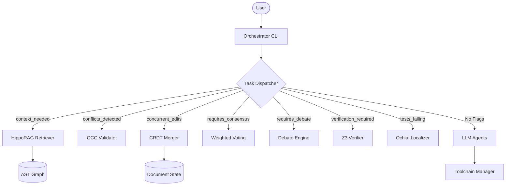

# Architecture

Project Swarm v3.0 is a Python-native, algorithmically augmented orchestrator for autonomous AI development.

## System Overview



## Core Components

### 1. Algorithmic Workers (`mcp_core/algorithms/`)

| Worker | Purpose | Key Tech |
| :--- | :--- | :--- |
| **HippoRAG** | Deep Context Retrieval | AST Graphs + Personalized PageRank |
| **OCC Validator** | Concurrency Control | SHA256 Versioning + Atomic Writes |
| **CRDT Merger** | Collaborative Editing | YATA Sequence (pycrdt) |
| **Voting** | Consensus | Confidence-weighted + Elo Ratings |
| **Debate** | Reasoning | Sparse Topology + Blind Drafting |
| **Z3 Verifier** | Formal Verification | SMT Solver (Symbolic Execution) |
| **Ochiai SBFL** | Automated Debugging | Spectrum-Based Fault Localization |

### 2. Orchestrator Core (`mcp_core/orchestrator_loop.py`)

- **Task Dispatch:** Analyzes boolean flags on `Task` objects to route work.
- **State Management:** Uses `FileLock` for rudimentary persistence (with OCC for granular file safety).
- **Fallback:** Routes general instruction tasks to LLM-based agents (Architect/Engineer).

### 3. Search Engine (`mcp_core/search_engine.py`)

*Legacy v2.0 component, retained for keyword search fallback.*
- **CodebaseIndexer:** Scans files to create chunks.
- **HybridSearch:** Combines semantic (vector) and keyword retrieval.

### 4. Toolchain Manager (`mcp_core/toolchain_manager.py`)

Abstractions for build/test operations:
- Maps intents (`test`, `lint`) to concrete commands (`pytest`, `flake8`).
- Used by `OchiaiLocalizer` to execute test suites coverage.

## Data Flow

### Example: Automated Debugging
1. **Trigger:** Task marked with `tests_failing=True`.
2. **Dispatch:** Router sends task to `OchiaiLocalizer`.
3. **Execution:**
   - Runs `pytest` with `coverage`.
   - Calculates suspiciousness spectrum.
   - Generates ranked list of buggy lines.
4. **Handoff:** Debug prompt sent to LLM Agent to write the fix.

## File Structure

```
swarm/
├── mcp_core/
│   ├── algorithms/     # v3.0 Algorithm Workers
│   ├── orchestrator_loop.py
│   ├── search_engine.py
│   └── ...
├── tests/
│   └── algorithms/     # v3.0 Test Suite
├── orchestrator.py     # CLI Entrypoint
└── ...
```
