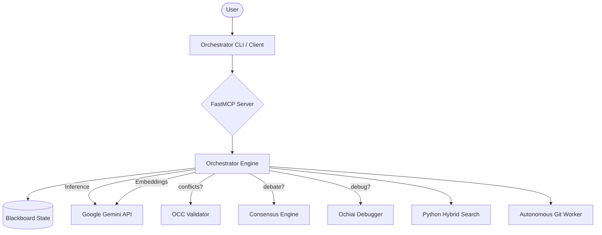

# Architecture

Project Swarm v3.1 is a Python-native, "Gemini-First" autonomous AI development orchestrator. It unifies state management, algorithmic reasoning, and MCP-based tool execution into a single, cohesive system.

## System Overview



## Core Components

### 1. The Protocol (Orchestrator)
Located in `mcp_core/orchestrator_loop.py`.
- **State Machine**: Manages the lifecycle of tasks and context.
- **Model Router**: `mcp_core/llm.py` implements a smart cascade:
    - **Primary**: `gemini-3-flash-preview`
    - **Fallback**: `gemini-2.5-flash` -> `gemini-2.5-pro`
    - **Local**: `ollama/llama3` (optional)

### 2. The Blackboard (State)
- **Primary State**: `project_profile.json`
- **Concurrency**: `FileLock` ensures thread-safe writes between the SSE server and background workers.
- **Persistence**: File-system based JSON storage, ready for SQLite/WAL migration.

### 3. Native Gemini Integration
- **Inference**: Direct gRPC/REST calls for high-speed reasoning.
- **Embeddings**: `models/text-embedding-004` powers the search engine.
- **Context**: 1M+ token window utilized for full-file analysis and HippoRAG graph construction.

### 4. Autonomous Workers
- **Git Worker**: Monitors file system events, generates semantic commits, and manages PR lifecycles.
- **Search Engine**: Pure Python implementation combining Keyword (BM25-like) and Semantic (Gemini Embeddings) search.

## Data Flow

### Example: Autonomous Git Commit
1. **Event**: User saves a file.
2. **Detection**: `GitWorker` notes the dirty state.
3. **Reasoning**: Routes diff to `gemini-3-flash-preview` for "Git Writer" role.
4. **Action**: Generates conventional commit message.
5. **Execution**: Commits changes via `subprocess` (if auto-commit enabled).

## File Structure

```
swarm/
├── mcp_core/
│   ├── llm.py              # Gemini Router & Fallback Logic
│   ├── orchestrator_loop.py # Main Event Loop
│   ├── search_engine.py    # Python Search & Indexing
│   ├── git_worker.py       # Autonomous Version Control
│   └── algorithms/         # v3.0 Advanced Logic (OCC, Z3, etc.)
├── server.py               # FastMCP Server Entrypoint
├── Dockerfile              # Python 3.11 Slim Image
└── project_profile.json    # The Blackboard
```
