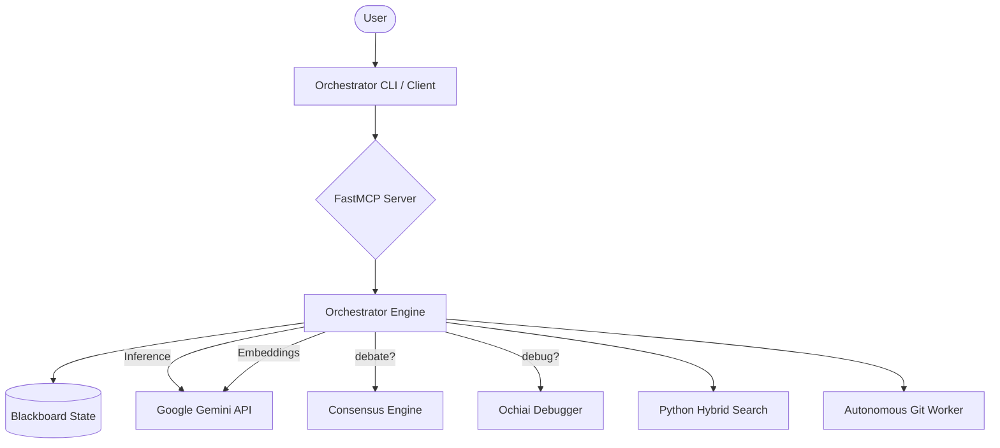

# Architecture

Project Swarm v3.3 is a Python-native, "Gemini-First" autonomous AI development orchestrator. It unifies state management, algorithmic reasoning, and a multi-role autonomous Git engine into a single, cohesive system.

## System Overview



## Core Components

### 1. The Protocol (Orchestrator)
Located in `mcp_core/orchestrator_loop.py`.
- **State Machine**: Manages the lifecycle of tasks and context.
- **Model Router**: `mcp_core/llm.py` implements a smart cascade:
    - **Primary**: `gemini-3-flash-preview`
    - **Fallback**: `gemini-2.5-flash` -> `gemini-2.5-pro`
    - **Local**: `ollama/llama3` (optional)

### 2. The Blackboard (State)
- **Primary State**: `project_profile.json`, managed via **Pydantic** models in `mcp_core/swarm_schemas.py`.
- **Concurrency**: Cross-platform **FileLock** ensures thread-safe and process-safe writes between agents and the orchestrator.
- **Persistence**: File-system based JSON storage with atomic write validation.
- **Strategic State**: Bi-directional sync with `docs/PLAN.md` and `issues.md` for human-readable roadmaps.

### 3. Native Gemini Integration
- **Inference**: Direct gRPC/REST calls for high-speed reasoning.
- **Embeddings**: `models/text-embedding-004` powers the search engine.
- **Context**: 1M+ token window utilized for full-file analysis and HippoRAG graph construction.

### 4. Autonomous Git Engine
Swarm v3.3 introduces a multi-role Git system designed for high-autonomy workflows.
> [!WARNING]
> **Status: 🚧 Experimental Skeleton**
> The high-level roles are defined, but internal logic is currently stubbed with placeholders.

- **Roles**:
    - **Feature Scout**: Scans codebase for expansion opportunities.
    - **Code Auditor**: Identifies bugs and documentation drift.
    - **Issue Triage**: Prioritizes and assigns tasks from the backlog.
    - **Branch Manager**: Manages merging and stacked PR chains.
    - **Project Lifecycle**: Orchestrates repository creation and bootstrapping.
- **Integrations**: Uses `git-mcp` for local operations and `github-mcp` for remote PR management.

## Component Maturity Matrix

| Component | Maturity | Description |
|-----------|----------|-------------|
| **Orchestrator Protocol** | `✅ Stable` | Core state machine and event loop logic. |
| **LLM Router** | `✅ Stable` | Gemini-first with robust provider cascading. |
| **Search Engine** | `✅ Stable` | Hybrid Keyword code search (~1ms latency). |
| **HippoRAG Retriever** | `✅ Stable` | Multi-language AST graph analysis (Python, JS, TS, Go, Rust). |
| **Ochiai Debugger** | `✅ Stable` | Statistical fault localization with coverage integration. |
| **Z3 Verifier** | `⚠️ Partial` | Core SMT solver integration complete; high-level generators missing. |
| **Git Agent Roles** | `🚧 Skeleton` | Role definitions present; execution logic is stubbed. |
| **Deliberation Tool** | `🚧 Stub` | Redirects to sequential thinking; algorithmic worker delegation unimplemented. |

## Data Flow

### Example: Autonomous Handoff Flow
1. **Scout**: `Feature Scout` identifies a missing telemetry feature and creates a task.
2. **Orchestrator**: Updates `project_profile.json` and assigns to the `Engineer`.
3. **Execution**: `Engineer` creates a branch (e.g., `feat/provenance`), applies edits, and runs tests.
4. **Audit**: `Code Auditor` scans the branch for bugs and documentation drift.
5. **Manager**: `Branch Manager` opens a PR and monitors for CI/approval.

## File Structure

```
swarm/
├── mcp_core/
│   ├── llm.py              # Gemini Router & Fallback Logic
│   ├── orchestrator_loop.py # Main Event Loop
│   ├── search_engine.py    # Python Search & Indexing
│   ├── git_worker.py       # Autonomous Version Control
│   └── algorithms/         # v3.2 Advanced Logic (SBFL, Z3, etc.)
├── server.py               # FastMCP Server Entrypoint
├── Dockerfile              # Python 3.11 Slim Image
└── project_profile.json    # The Blackboard
```
