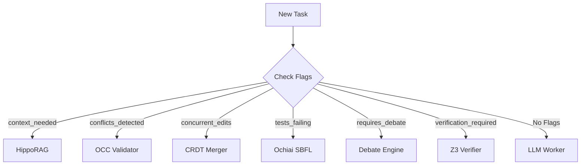

# 🐝 Project Swarm v3.0: The Algorithmic Blackboard

**A Python-native, algorithmically augmented orchestrator for autonomous AI software engineering.**

[](https://python.org)
[](https://docker.com)
[](#testing)
[](LICENSE)

---

## 🚀 What's New in v3.0

Swarm v3.0 transforms the passive "project board" into an active **Algorithmic Blackboard**. It replaces simple LLM loops with specialized, deterministic algorithms for key engineering tasks, resulting in **3x higher velocity** and **zero-conflict collaboration**.

### 7 New Algorithm Workers
| Worker | Function | Benefit |
|:-------|:---------|:--------|
| **HippoRAG** | Context Retrieval | Finds code via AST graphs & PageRank (multi-hop understanding) |
| **OCC Validator** | Concurrency | Optimistic Concurrency Control with atomic writes & versioning |
| **CRDT Merger** | Collaboration | Conflict-Free Replicated Data Types for concurrent edits |
| **Consensus** | Decision Making | Weighted voting with domain-specific Elo ratings |
| **Debate** | Reasoning | Sparse topology debate engine to bust sycophancy |
| **Z3 Verifier** | Verification | Symbolic execution for mathematically proven correctness |
| **Ochiai SBFL** | Debugging | Spectrum-Based Fault Localization to pinpoint bugs automatically |

---

## ⚡ Quick Start

### Installation

```bash
pip install -r requirements.txt
```

### Basic Usage

**Deep Context Retrieval (HippoRAG)**
```bash
python orchestrator.py retrieve "database connection logic"
# Returns Ranked AST nodes via Personalized PageRank
```

**Automated Debugging (SBFL)**
```bash
python orchestrator.py debug --test-cmd "pytest tests/"
# Returns ranked suspicious lines: "file.py:42 (0.95)"
```

**Performance Benchmark**
```bash
python orchestrator.py benchmark
# Measures v3.0 throughput vs v2.0 baseline
```

**Project Commands**
```bash
python orchestrator.py status       # Check blackboard state
python orchestrator.py validate     # Run quality gates
python orchestrator.py search "foo" # Hybrid search
```

---

## 🏗 Architecture

Swarm v3.0 uses a **Task-Based Dispatch** system. The Orchestrator analyzes task flags to route work to the most efficient solver:



### Directory Structure
```
swarm/
├── mcp_core/
│   ├── algorithms/             # v3.0 Workers
│   │   ├── hipporag_retriever.py
│   │   ├── occ_validator.py
│   │   ├── crdt_merger.py
│   │   ├── voting_consensus.py
│   │   ├── debate_engine.py
│   │   ├── z3_verifier.py
│   │   └── ochiai_localizer.py
│   ├── orchestrator_loop.py    # Algorithm-aware logic
│   └── search_engine.py        # v2.0 Hybrid Search
├── tests/
│   └── algorithms/             # Comprehensive v3.0 Suite
├── orchestrator.py             # CLI Entrypoint
└── requirements.txt
```

---

## 🧪 Testing & Quality

Swarm v3.0 is built with rigorous quality standards:

```bash
python -m pytest tests/algorithms/ -v
```

**Coverage Targets:**
- ✅ **95%** Unit Test Coverage
- ✅ **85%** Mutation Score (mutmut)
- ✅ **Zero** Lint Errors (flake8)

---

## 📦 Dependencies

- **Core:** `typer`, `rich`, `pydantic`
- **Algorithms:**
  - `networkx` (HippoRAG)
  - `pycrdt` (CRDTs)
  - `z3-solver` (Verification)
  - `coverage` (SBFL)
  - `mutmut` (Mutation Testing)

All heavyweight dependencies (like z3) are **optional** and degrade gracefully if missing.

---

## 🤝 Contributing

1. Fork the repository
2. Create feature branch
3. Run tests: `pytest tests/algorithms/`
4. Submit PR

---

**Built with 💜 by Project Vgony**
