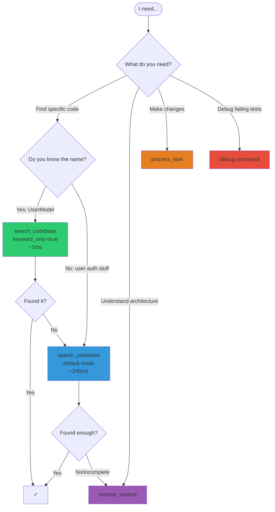
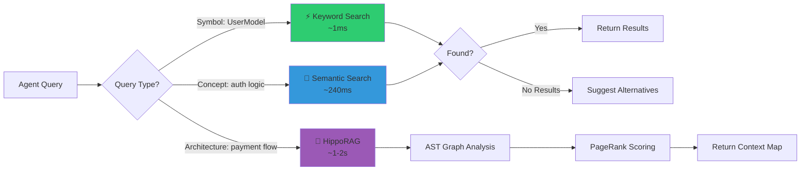

<div align="center">

      ███████╗██╗    ██╗ █████╗ ██████╗ ███╗   ███╗
      ██╔════╝██║    ██║██╔══██╗██╔══██╗████╗ ████║
      ███████╗██║ █╗ ██║███████║██████╔╝██╔████╔██║
      ╚════██║██║███╗██║██╔══██║██╔══██╗██║╚██╔╝██║
      ███████║╚███╔███╔╝██║  ██║██║  ██║██║ ╚═╝ ██║
      ╚══════╝ ╚══╝╚══╝ ╚═╝  ╚═╝╚═╝  ╚═╝╚═╝     ╚═╝
</div>
<div align="center">

### 🌐 **Built for autonomous software engineeering**

[](https://python.org)
[](https://docker.com)
[](https://github.com/orgs/${{ github.repository_owner }}/packages)
[](https://modelcontextprotocol.io)
[](LICENSE)
[](https://trivy.dev)
[](https://sigstore.dev)

[](https://modelcontextprotocol.io)
[](https://arxiv.org/)
[](https://en.wikipedia.org/wiki/Fault_localization)

## 📖 Documentation

<table>
<tr>
<td width="60%">

### 👨‍💻 For Humans
- [Getting Started](docs/human/getting-started.md)
- [User Guide](docs/human/user-guide.md)
- [Algorithm Workers](docs/human/workers.md)
- [API Reference](docs/human/api-reference.md)
- [Configuration](docs/human/configuration.md)
- [Performance](docs/human/performance.md)

</td>
<td width="40%">

### For AI
- [Agent Guide](docs/ai/agent-guide.md)
- [Tool Reference](docs/ai/tool-reference.md)
- [Examples](docs/ai/examples.md)
- [Decision Trees](docs/ai/agent-guide.md#decision-trees)

</td>
</tr>
</table>

## 🎯 Tool Selection Guide

**Which tool should your agent use?**


---

### 🐝 How It Works


---

## 🌟 What Makes Swarm Different?

> [!IMPORTANT]
> HippoRAG is *slower* than keyword search (~1-2s vs ~1ms) but provides deep architectural context. Use it when you need to understand relationships, not just find text.

<table>
<tr>
<td width="50%">

### 🧠 **Algorithmic Intelligence**
- **Autonomous Git Engine**: Multi-role autonomous repository management.
- **HippoRAG**: AST-based knowledge graphs with Personalized PageRank.
- **Ochiai SBFL**: Statistical fault localization for debugging.
- **Z3 Verifier**: Formal verification using SMT solving.


</td>
<td width="50%">

### ⚡ **Performance-First Design**
- **Auto-Pilot Search**: Symbol queries execute at ~1ms (200x faster than semantic)
- **Multi-Language AST**: Python, JavaScript, TypeScript support
- **Hybrid Search**: Semantic + keyword with multiple embedding providers
- **Rolling Memory**: LLM-native context management

</td>
</tr>
</table>

### 📊 Swarm vs Standard MCP Servers

| **Search Method** | Basic keyword/regex | Hybrid semantic + keyword with auto-optimization |
| **Code Understanding** | Text parsing | AST-based knowledge graphs with PageRank |
| **Debugging** | Stack trace reading | Statistical fault localization (Ochiai) |
| **Version Control** | Basic git tools | Autonomous multi-role Git engine |
| **Language Support** | Single or limited | Python, JavaScript, TypeScript (extensible) |
| **Memory Management** | Stateless | Rolling memory with active/archive tiers |


---

## 🚀 Quick Start

<details open>
<summary><b>🐳 Docker Installation (Recommended)</b></summary>

```bash
# Clone and launch
git clone https://github.com/yourusername/swarm.git
cd swarm
docker compose up -d --build

# Server available at http://localhost:8000
```

**Configure your IDE:**
```json
{
  "mcpServers": {
    "swarm-orchestrator": {
      "command": "docker",
      "args": ["exec", "-i", "swarm-mcp-server", "fastmcp", "run", "server.py"]
    }
  }
}
```

</details>

<details>
<summary><b>💻 Local Installation</b></summary>

```bash
git clone https://github.com/yourusername/swarm.git
cd swarm
pip install .

# Run as MCP server
python server.py --sse

# Or use CLI directly
swarm status
```

</details>

> [!TIP]
> **First time setup?** Set your `GEMINI_API_KEY` in `.env` for best performance. Swarm supports multiple embedding providers (Gemini, OpenAI, local).


## ✨ Features Deep Dive

### 🧠 External Memory Integration

Project Swarm integrates seamlessly with the [Knowledge Graph Memory Server](https://github.com/modelcontextprotocol/servers/tree/main/src/memory). We recommend running it in an isolated container for persistent storage.

**Setup for Antigravity / Cursor:**
```json
{
  "mcpServers": {
    "memory": {
      "command": "docker",
      "args": [
        "run", "-i", "--rm",
        "-v", "${HOME}/.antigravity/memory.json:/app/memory.json",
        "node:18-alpine",
        "npx", "-y", "@modelcontextprotocol/server-memory",
        "/app/memory.json"
      ]
    }
  }
}
```

---

### 🧠 **HippoRAG: Deep Code Understanding**

Unlike traditional semantic search, HippoRAG builds an Abstract Syntax Tree (AST) knowledge graph of your codebase and uses **Personalized PageRank** to find architecturally relevant code.

```python
# Traditional search finds the function name
search_codebase("UserModel")  # ✓ Fast but shallow

# HippoRAG finds everything connected to the concept
retrieve_context("user authentication flow")
# → Returns: UserModel, AuthService, TokenManager, 
#            SessionStore, LoginController
# → Includes: Call graphs, import chains, usage patterns
```

**Supported Languages:**
- 🐍 **Python** (built-in `ast` module)
- 📜 **JavaScript/JSX** (via Tree-sitter)
- 🔷 **TypeScript/TSX** (via Tree-sitter)
- 🔜 **Go, Rust, Java** (plugin system ready)

---

### ⚡ **Auto-Pilot Search Optimization**

Swarm automatically detects if you're searching for a symbol or a concept and optimizes accordingly:

```python
# Automatically uses keyword search (1ms)
search_codebase("UserModel")
search_codebase("calculate_tax")
search_codebase("API_KEY")

# Automatically uses semantic search (240ms)
search_codebase("authentication logic")
search_codebase("database connection pooling")
search_codebase("error handling patterns")
```

**Performance Comparison:**

| Search Type | Speed | Use When |
|------------|-------|----------|
| **Keyword** | ~1ms | You know the exact name (class, function, variable) |
| **Semantic** | ~240ms | You know the concept but not the implementation |
| **HippoRAG** | ~1-2s | You need to understand architecture and relationships |

---


### 🐛 **Ochiai SBFL: Automated Fault Localization**

Statistical fault localization pinpoints bugs faster than manual debugging:

```bash
# Traditional debugging: read stack traces, guess locations
pytest tests/test_payment.py  # ❌ 3 tests fail

# Ochiai debugging: statistically identifies suspicious code
python orchestrator.py debug --test-cmd "pytest tests/test_payment.py"
# → payment.py:127 (Suspiciousness: 0.89)
# → payment.py:145 (Suspiciousness: 0.76)
# → utils.py:23 (Suspiciousness: 0.34)
```

---

### 📝 **Rolling Memory System**

LLM-native context management prevents prompt bloat:

```
memory/
├── active/           # Current session context
│   ├── task_001.md   # In-progress refactoring
│   └── context_auth.md
└── archive/          # Completed work (compressed)
    └── 2026-01-19.md
```

**Memory Skills:**
- `orient_context`: Session initialization and context loading
- `refresh_memory`: Prune completed tasks to archive
- `roadmap_sync`: Track long-term project goals

---

## 🛠️ Usage Examples

### Example 1: Deep Architectural Analysis

```python
# Step 1: Quick search to find entry point
search_codebase("PaymentProcessor", keyword_only=True)
# → Found: payment/processor.py:PaymentProcessor

# Step 2: Deep dive into the architecture
retrieve_context("payment processing pipeline")
# → Returns knowledge graph:
#   - PaymentProcessor (entry point)
#   - StripeClient (external API)
#   - TransactionLogger (observability)
#   - PaymentQueue (async processing)
#   - RefundHandler (error recovery)
#   - Call graph with dependencies
```

### Example 2: Conflict-Free Refactoring

```python
# Let Swarm handle the complexity
process_task("""
Refactor payment/processor.py to:
1. Use async/await instead of callbacks
2. Add retry logic with exponential backoff
3. Ensure thread-safety
""")

# Swarm will:
# ✓ Analyze AST to understand current structure
# ✓ Apply changes atomically
# ✓ Verify no concurrent edits occurred
```

### Example 3: Automated Debugging

```bash
# Tests are failing, but where's the bug?
python orchestrator.py debug --test-cmd "pytest tests/test_auth.py::TestLogin"

# Output:
# 🐛 Ochiai Fault Localization Results:
# 
# Suspiciousness Rankings:
# 1. auth/login.py:89  (0.92) ← Check here first!
# 2. auth/session.py:45 (0.78)
# 3. utils/crypto.py:12 (0.34)
```

---

## 🔧 Configuration

### Environment Variables

```bash
# Required for best performance
GEMINI_API_KEY=your_key_here

# Optional: Alternative embedding providers
OPENAI_API_KEY=your_key_here

# Optional: Ollama for local models
OLLAMA_BASE_URL=http://localhost:11434
```

### Embedding Provider Options

```python
# Auto-detect best available (recommended)
index_codebase()  # Tries: Gemini → OpenAI → Local → Keyword-only

# Force specific provider
index_codebase(provider="gemini")  # Fast API calls (~2-5s)
index_codebase(provider="openai")  # Alternative fast option
index_codebase(provider="local")   # Offline, no API costs (~60-120s)
```
---

## 🤝 Contributing

We welcome contributions! See [CONTRIBUTING.md](CONTRIBUTING.md) for guidelines.

### 🎯 Areas We Need Help
- [ ] Parser plugins for Go, Rust, Java
- [ ] Performance benchmarks for large codebases (>100k files)
- [ ] Integration guides for other IDEs
- [ ] Additional algorithm workers (BERT-based search, neural bug localization)

---

## 📊 Performance Metrics

| Operation | Swarm | Alternative | Speedup |
|-----------|-------|-------------|---------|
| **Symbol Search** | ~1ms | ~240ms (semantic only) | **240x** |
| **Codebase Indexing** (Gemini) | ~45s (150 chunks) | N/A | - |
| **Codebase Indexing** (Local) | ~60-120s | N/A | - |
| **HippoRAG Retrieval** | ~1-2s | N/A (unique feature) | - |


---

## 📜 License

MIT License - See [LICENSE](LICENSE) for details.

---

## 🔗 Resources

<table>
<tr>
<td align="center" width="25%">

### 📚 Docs
[Documentation](docs/)

</td>
<td align="center" width="25%">

### 📝 Changelog
[CHANGELOG.md](CHANGELOG.md)

</td>
<td align="center" width="25%">

### 🔒 Security
[SECURITY.md](SECURITY.md)

</td>
<td align="center" width="25%">
</div>

</div>


