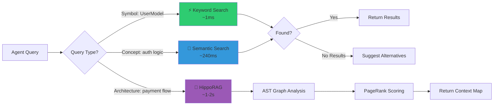
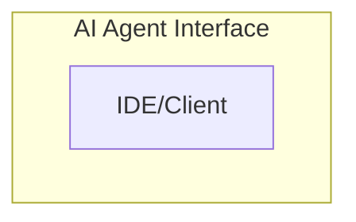

<div align="center">
```
███████╗██╗    ██╗ █████╗ ██████╗ ███╗   ███╗
██╔════╝██║    ██║██╔══██╗██╔══██╗████╗ ████║
███████╗██║ █╗ ██║███████║██████╔╝██╔████╔██║
╚════██║██║███╗██║██╔══██║██╔══██╗██║╚██╔╝██║
███████║╚███╔███╔╝██║  ██║██║  ██║██║ ╚═╝ ██║
╚══════╝ ╚══╝╚══╝ ╚═╝  ╚═╝╚═╝  ╚═╝╚═╝     ╚═╝
```

### 🐝 **Algorithmic Intelligence Meets Autonomous Development**

---

[](https://python.org)
[](https://docker.com)
[](https://modelcontextprotocol.io)
[](LICENSE)

### 🌐 Learn More

[](https://modelcontextprotocol.io)
[](https://arxiv.org/)
[](https://en.wikipedia.org/wiki/Fault_localization)

---

</div>

---

### 🔍 How It Works



---

## Architecture


