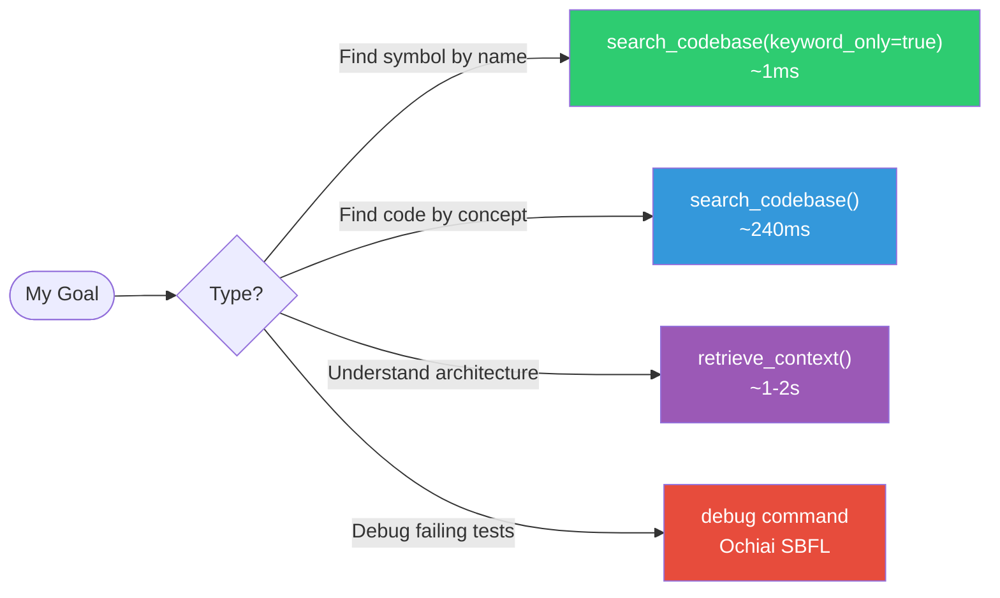

> **⚠️ DEPRECATED:** Fully migrated to hermes agent.

<div align="center">

  # Swarm Orchestrator v3.4

  ### Turn your IDE into an Autonomous Engineering Team

  [](https://python.org)
  [](https://docker.com)
  [](https://modelcontextprotocol.io)
  [](LICENSE)

</div>

**Swarm Orchestrator** is a Model Context Protocol (MCP) server that extends AI coding assistants like Antigravity, Cursor, and Claude Desktop with **deterministic, algorithmic capabilities**. Instead of relying purely on LLM reasoning, Vexorbis Swarm uses specialized workers—code analysis, fault localization, formal verification, and autonomous Git management—to deliver faster, more reliable results.

  ## 📖 Documentation
  
<div align="center">

| Getting Started | Concepts | Guides | Reference |
|-----------------|----------|--------|-----------|
| [Introduction](docs/human/getting-started/introduction.md) | [Architecture](docs/human/concepts/architecture.md) | [PLAN.md Syntax](docs/human/guides/plan-syntax.md) | [Tools](docs/human/reference/tools.md) |
| [Installation](docs/human/getting-started/installation.md) | [Decision Logic](docs/human/concepts/decision-logic.md) | [Git Workflows](docs/human/guides/git-workflows.md) | [Configuration](docs/human/reference/configuration.md) |
| [Quick Start](docs/human/getting-started/quickstart.md) | [Three Pillars](docs/human/concepts/three-pillars.md) | [Debugging](docs/human/guides/debugging.md) | [API Reference](docs/human/reference/api.md) |
| | | [Custom Tools](docs/human/guides/custom-tools.md) | [Troubleshooting](docs/human/reference/troubleshooting.md) |

</div>

## 🚀 Quick Start

### Docker (Recommended)

```bash
git clone https://github.com/AgentAgony/swarm.git
cd swarm
docker compose up -d --build
```

### Configure Your IDE

Add the MCP server to your IDE's configuration (e.g., `~/.gemini/antigravity/mcp_config.json` on Windows):

```json
{
  "mcpServers": {
    "swarm-orchestrator": {
      "command": "docker",
      "args": ["exec", "-i", "swarm-mcp-server", "python", "server.py"]
    }
  }
}
```

---

## 🔍 Tool Selection Guide



## 📜 License

MIT


