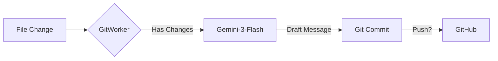

# Swarm Workers & Algorithms

Comprehensive guide to Project Swarm's specialized algorithm workers and their capabilities.

---

## Table of Contents

1. [Overview](#overview)
2. [OCC Validator](#occ-validator) - Conflict Detection
3. [Ochiai SBFL](#ochiai-sbfl) - Fault Localization
4. [Z3 Verifier](#z3-verifier) - Formal Verification
5. [CRDT Merger](#crdt-merger) - Collaborative Editing
6. [HippoRAG](#hipporag) - Context Retrieval
7. [Git Worker](#git-worker) - Autonomous Version Control
8. [Worker Routing](#worker-routing)

---

## Overview

Swarm uses **specialized algorithm workers** to handle complex software engineering tasks. Each worker implements a specific algorithm optimized for a particular problem domain.

### Worker Selection

Workers are automatically selected based on instruction patterns:

| Instruction Pattern | Worker | Algorithm |
|---------------------|--------|-----------|
| "refactor...", "modify..." | OCC Validator | Optimistic Concurrency Control |
| "debug...", "why is failing..." | Ochiai SBFL | Spectrum-Based Fault Localization |
| "verify...", "prove..." | Z3 Verifier | Symbolic Execution |
| "merge...", "combine..." | CRDT Merger | Conflict-Free Replicated Data Types |
| "analyze...", "understand..." | HippoRAG | Knowledge Graph + PageRank |

---

## OCC Validator

**Optimistic Concurrency Control** - Prevents data loss during concurrent file modifications.

### What It Does

Implements a three-phase protocol to detect and resolve conflicts when multiple agents edit the same file:

1. **Read Phase**: Snapshot file with version hash (SHA256)
2. **Process Phase**: Agent makes changes offline
3. **Validate & Commit**: Atomic check-and-replace

### Algorithm Theory

**Content-Addressed Versioning**:
```python
version_hash = SHA256(file_content)
```

**Atomic Write Pattern**:
```python
if current_hash == expected_hash:
    write_new_content()  # Success
else:
    attempt_merge()      # Collision detected
```

### When to Use

✅ **Use OCC Validator when:**
- Multiple agents refactoring the same codebase
- Collaborative editing sessions
- Preventing race conditions in file writes

❌ **Don't use for:**
- Single-agent workflows (unnecessary overhead)
- Read-only operations

### Example Usage

```python
<!--
from mcp_core.algorithms import OCCValidator

validator = OCCValidator(max_retries=3)
-->

# Phase 1: Read with version
content, version = validator.read_with_version("src/auth.py")

# Phase 2: Process (agent makes changes)
new_content = refactor(content)

# Phase 3: Validate and commit
result = validator.validate_and_commit(
    resource_path="src/auth.py",
    new_content=new_content,
    expected_version=version,
    attempt_merge=True
)

if result.status == OCCStatus.SUCCESS:
    print(f"✅ Committed: {result.new_version}")
elif result.status == OCCStatus.COLLISION:
    print(f"⚠️ Collision detected, retrying...")
elif result.status == OCCStatus.MERGE_CONFLICT:
    print(f"❌ Manual resolution required")
```

### Merge Strategy

OCC attempts **three-way merge** for non-overlapping changes:

```
Base:   def foo(): pass
Ours:   def foo(): return 1  # Agent A
Theirs: def bar(): pass      # Agent B
Merged: def foo(): return 1
        def bar(): pass      # ✅ No conflict
```

### Performance

- **Read**: ~1ms (file I/O + hash)
- **Validate**: ~2ms (hash comparison)
- **Merge**: ~10-50ms (diff algorithm)

---

## Ochiai SBFL

**Spectrum-Based Fault Localization** - Automated bug location using test coverage.

### What It Does

Ranks lines of code by **suspiciousness score** based on which lines are executed by failing vs passing tests.

### Algorithm Theory

**Ochiai Formula**:
```
S(line) = failed(line) / sqrt(total_failed * (failed(line) + passed(line)))
```

Where:
- `failed(line)`: Number of failing tests that execute this line
- `passed(line)`: Number of passing tests that execute this line
- `total_failed`: Total number of failing tests

**Score Range**: 0.0 (least suspicious) to 1.0 (most suspicious)

### When to Use

✅ **Use Ochiai SBFL when:**
- Tests are failing but root cause is unclear
- Large codebase with complex call graphs
- Need to narrow down debugging scope

❌ **Don't use for:**
- No test suite exists
- All tests passing (no failures to analyze)
- Syntax errors (use linter instead)

### Example Usage

```python
from mcp_core.algorithms import OchiaiLocalizer

localizer = OchiaiLocalizer()

# Run full SBFL analysis
debug_prompt = localizer.run_full_sbfl_analysis(
    test_command="pytest tests/",
    source_path="src/",
    top_k=5
)

print(debug_prompt)
```

**Output**:
```
🔍 Top 5 Suspicious Lines:

1. auth/handlers.py:67 (score: 0.95)
   if user.password == password:  # ⚠️ Plain text comparison

2. auth/models.py:23 (score: 0.87)
   self.token = generate_token()

3. database/query.py:145 (score: 0.72)
   cursor.execute(f"SELECT * FROM {table}")  # SQL injection
```

### Requirements

- **Python**: `coverage>=7.0` package
- **Test Suite**: Must have both passing and failing tests
- **Source Code**: Must be instrumented by coverage.py

### Performance

- **Coverage Collection**: ~5-30s (depends on test suite size)
- **Suspiciousness Calculation**: ~100-500ms
- **Total**: ~5-30s for typical project

---

## Z3 Verifier

**Symbolic Execution** - Proves that code satisfies contracts for ALL possible inputs.

### What It Does

Uses the **Z3 SMT Solver** to verify that postconditions hold for every input satisfying preconditions, not just sampled test cases.

### Algorithm Theory

**Symbolic Execution**:
```python
# Instead of testing concrete values:
assert calculate_tax(100) == 10  # Only tests one case

# Z3 verifies for ALL values:
x = z3.Int('amount')
result = calculate_tax_symbolic(x)
z3.prove(z3.Implies(x >= 0, result >= 0))  # Proves for infinite inputs
```

**SMT Solving**:
- Converts code to logical constraints
- Searches for counterexamples (inputs that violate postconditions)
- If no counterexample exists → **verified**

### When to Use

✅ **Use Z3 Verifier when:**
- Critical invariants must hold (e.g., "balance never negative")
- Testing all edge cases is infeasible
- Formal proof required (security, finance, safety)

❌ **Don't use for:**
- Complex algorithms (Z3 may timeout)
- Floating-point arithmetic (imprecise)
- I/O-heavy code (not symbolic)

### Example Usage

```python
from mcp_core.algorithms import Z3Verifier, create_symbolic_int
import z3

verifier = Z3Verifier(timeout_ms=5000)

# Define symbolic variables
amount = create_symbolic_int("amount")
rate = create_symbolic_int("rate")

# Preconditions
preconditions = [
    amount >= 0,
    rate >= 0,
    rate <= 100
]

# Implementation (symbolic)
def calculate_tax_symbolic(vars):
    return vars["amount"] * vars["rate"] / 100

# Postcondition
result = calculate_tax_symbolic({"amount": amount, "rate": rate})
postconditions = [result >= 0]  # Tax never negative

# Verify
verification = verifier.verify_function(
    func=calculate_tax_symbolic,
    preconditions=preconditions,
    postconditions=postconditions
)

if verification.verified:
    print("✅ Verified: Tax is always non-negative")
else:
    print(f"❌ Counterexample: {verification.counterexample}")
```

**Counterexample Output**:
```python
{
    "amount": -10,  # Violates precondition, but shows edge case
    "rate": 50
}
```

### Limitations

- **Timeout**: Complex constraints may not solve in 5s
- **Scalability**: Works best for functions with <10 branches
- **Precision**: Integer arithmetic only (no floats)

### Performance

- **Simple Functions**: ~10-100ms
- **Medium Complexity**: ~500ms-2s
- **Complex**: May timeout (5s default)

---

## CRDT Merger

**Conflict-Free Replicated Data Types** - Guarantees eventual consistency for collaborative editing.

### What It Does

Implements **YATA sequence CRDTs** (via `pycrdt`) to merge concurrent text edits without conflicts.

### Algorithm Theory

**YATA (Yet Another Transformation Approach)**:
- Each character has a unique ID: `(agent_id, position, timestamp)`
- Insertions are commutative: `A + B = B + A`
- Deletions are idempotent: `delete(x) + delete(x) = delete(x)`

**Example**:
```
Agent A: "Hello" → "Hello World"  (insert " World" at pos 5)
Agent B: "Hello" → "Hi"           (delete "ello", insert "i")

CRDT Merge: "Hi World"  # ✅ No conflict, both edits preserved
```

### When to Use

✅ **Use CRDT Merger when:**
- Multiple agents editing the same document simultaneously
- Network partitions possible (offline editing)
- Need strong eventual consistency

❌ **Don't use for:**
- Single-agent workflows
- Binary files (CRDTs are text-based)
- Structured data (use OCC instead)

### Example Usage

```python
from mcp_core.algorithms import CRDTMerger

merger = CRDTMerger()

# Create document
merger.create_document("doc1", initial_content="Hello")

# Agent A: Insert " World"
update_a = merger.insert_text("doc1", position=5, text=" World")

# Agent B: Delete "ello", insert "i"
update_b = merger.delete_text("doc1", start=1, end=5)
update_b2 = merger.insert_text("doc1", position=1, text="i")

# Apply updates (order doesn't matter)
merger.apply_update("doc1", update_b)
merger.apply_update("doc1", update_a)

# Get merged state
final = merger.get_state("doc1")
print(final)  # "Hi World"
```

### Binary Update Vectors

CRDTs use **binary diffs** for efficient synchronization:

```python
update = merger.get_update_vector("doc1")
# → b'\x01\x02\x03...' (compact binary format)

# Send to other replicas
other_merger.apply_update("doc1", update)
```

### Performance

- **Insert**: ~1-5ms per operation
- **Delete**: ~1-5ms per operation
- **Merge**: ~10-50ms (depends on conflict density)
- **History**: O(n) where n = number of operations

---

## HippoRAG

**Knowledge Graph Retrieval** - Finds related code using AST graphs and Personalized PageRank.

### What It Does

Builds a **knowledge graph** from code structure (function calls, imports, inheritance) and uses **Personalized PageRank** to find architecturally related code.

**Multi-Language Support**: HippoRAG now supports multiple programming languages via parser plugins:
- ✅ **Python** (built-in, always available)
- ✅ **JavaScript/TypeScript** (optional, requires Tree-sitter packages)
- 🔮 **Future**: Go, Rust, Java (plugin system ready)

### Algorithm Theory

**Graph Construction**:
```
Nodes: Functions, Classes, Modules, Interfaces (TS), Types (TS)
Edges: Calls, Imports, Inheritance, Implements
```

**Personalized PageRank (PPR)**:
```
PPR(node) = (1 - α) * seed_weight + α * Σ(PPR(neighbor) / out_degree(neighbor))
```

Where:
- `α = 0.85` (damping factor)
- `seed_weight`: 1.0 for query matches, 0.0 otherwise

**Ranking**: Nodes with high PPR scores are structurally central to the query.

### When to Use

✅ **Use HippoRAG when:**
- Understanding code architecture
- Finding ALL code related to a feature (multi-hop reasoning)
- Refactoring requires full dependency context
- Analyzing polyglot codebases (Python + JS/TS)

❌ **Don't use for:**
- Simple function lookups (use `search_codebase` instead)
- Unsupported languages (unless you add a parser plugin)
- Quick questions (slower than semantic search)

### Enabling Multi-Language Support

**Python Only** (default, no extra dependencies):
```python
from mcp_core.algorithms import HippoRAGRetriever

retriever = HippoRAGRetriever()
# Automatically uses built-in Python AST parser
retriever.build_graph_from_ast(".")
```

**JavaScript/TypeScript** (requires optional packages):
```bash
# Install Tree-sitter packages
pip install tree-sitter tree-sitter-javascript tree-sitter-typescript
```

```python
retriever = HippoRAGRetriever()
# Automatically detects and loads JS/TS parsers if installed
# INFO: Multi-language support enabled: JavaScript, TypeScript

# Build graph from all supported languages
retriever.build_graph_from_ast(".")  # Auto-detects .py, .js, .ts, .tsx

# Or specify extensions manually
retriever.build_graph_from_ast(".", extensions=[".py", ".ts"])
```

### Example Usage

```python
from mcp_core.algorithms import HippoRAGRetriever

retriever = HippoRAGRetriever()

# Build graph from AST
retriever.build_graph_from_ast(".", extensions=[".py"])

print(f"Graph: {retriever.graph.number_of_nodes()} nodes, {retriever.graph.number_of_edges()} edges")

# Retrieve context
chunks = retriever.retrieve_context("authentication flow", top_k=10)

for chunk in chunks:
    print(f"{chunk.node_type} {chunk.node_name} (PPR: {chunk.ppr_score:.4f})")
    print(f"  {chunk.file_path}:{chunk.start_line}-{chunk.end_line}")
```

**Output**:
```
function handle_oauth_callback (PPR: 0.8734)
  auth/handlers.py:45-67

class OAuthProvider (PPR: 0.8123)
  auth/models.py:12-28

function validate_token (PPR: 0.7456)
  auth/utils.py:89-102
```

### Comparison: HippoRAG vs Semantic Search

| Aspect | Semantic Search | HippoRAG |
|--------|-----------------|----------|
| Speed | ~240ms | ~500-2000ms |
| Depth | Surface-level | Architectural |
| Method | Embeddings | AST + Graph |
| Languages | All | Python only |
| Use for | Quick lookups | Deep analysis |

### Performance

- **Graph Build**: ~500ms-2s (depends on codebase size)
- **PPR Computation**: ~100-500ms
- **Total**: ~1-3s for typical project

---

## Git Worker

**Autonomous Version Control** - Semantically meaningful commits and PR management.

### What It Does

The Git Worker is a background autonomous agent that:
1.  **Monitors** the file system for changes ("dirty state").
2.  **Diffs** the changes to understand *what* happened.
3.  **Generates** a Conventional Commit message using `gemini-3-flash-preview` (high speed).
4.  **Commits** the changes (if `git_auto_commit` is enabled).

### Workflow



### Configuration

Controlled via `project_profile.json` or `process_task` commands:

```python
# Enable/Disable
process_task("Enable autonomous git commits")

# Manual Trigger
process_task("Commit these changes with message 'Refactor auth'")
```

### Models

- **Git Writer**: Defaults to `gemini-3-flash-preview` for sub-2s latency on commit message generation.

---

## Worker Routing

### Automatic Selection

Swarm analyzes instruction patterns to route tasks:

```python
# server.py - Routing logic
def route_worker(instruction: str) -> str:
    if re.search(r'\b(refactor|modify|change)\b', instruction, re.I):
        return "OCC Validator"
    elif re.search(r'\b(debug|failing|broken)\b', instruction, re.I):
        return "Ochiai SBFL"
    elif re.search(r'\b(verify|prove|ensure)\b', instruction, re.I):
        return "Z3 Verifier"
    elif re.search(r'\b(merge|combine|sync)\b', instruction, re.I):
        return "CRDT Merger"
    elif re.search(r'\b(analyze|understand|explore)\b', instruction, re.I):
        return "HippoRAG"
    else:
        return "General Worker"
```

### Manual Override

You can explicitly request a worker:

```python
process_task("Use OCC: Refactor auth.py to use async/await")
process_task("Use SBFL: Debug login failure in test_auth.py")
process_task("Use Z3: Verify calculate_tax never returns negative")
```

### Multi-Worker Tasks

Complex tasks may use multiple workers:

```
1. HippoRAG → Find all authentication code
2. OCC Validator → Refactor with conflict detection
3. Ochiai SBFL → Debug any test failures
4. Z3 Verifier → Verify security invariants
```

---

## Best Practices

### 1. Choose the Right Worker

| Goal | Worker | Why |
|------|--------|-----|
| Prevent conflicts | OCC Validator | Atomic writes |
| Find bugs | Ochiai SBFL | Coverage analysis |
| Prove correctness | Z3 Verifier | Formal methods |
| Merge edits | CRDT Merger | Eventual consistency |
| Understand architecture | HippoRAG | Graph traversal |

### 2. Combine Workers

```python
# Example: Refactor with verification
process_task("Refactor auth.py to use async/await")  # OCC
process_task("Verify auth.py never leaks credentials")  # Z3
process_task("Debug any failing auth tests")  # SBFL
```

### 3. Understand Limitations

- **OCC**: Requires file-based workflows
- **SBFL**: Requires test suite
- **Z3**: Limited to simple functions
- **CRDT**: Text-only, no binary files
- **HippoRAG**: Python AST only

---

## Next Steps

- **[User Guide](user-guide.md)** - How to use Swarm tools
- **[API Reference](api-reference.md)** - Detailed tool specifications
- **[Performance](performance.md)** - Benchmarks and optimization
